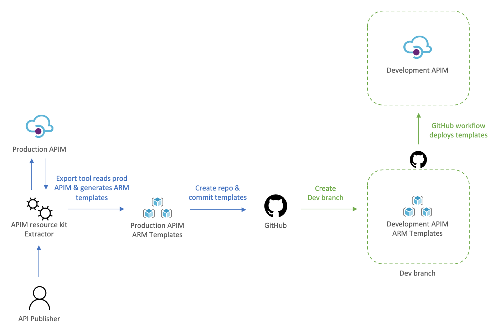
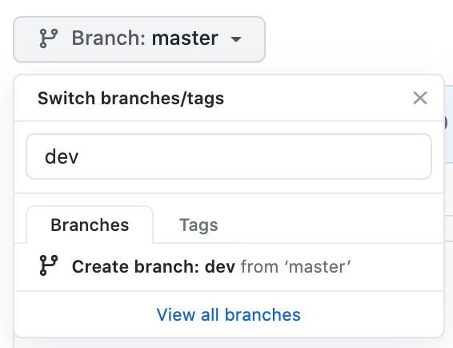
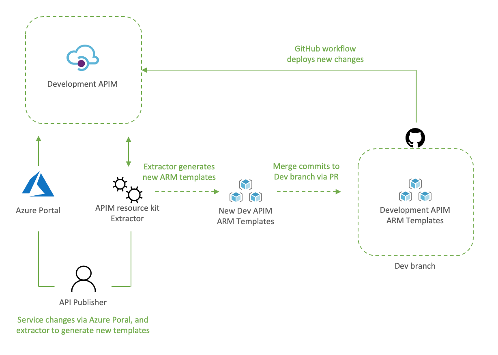
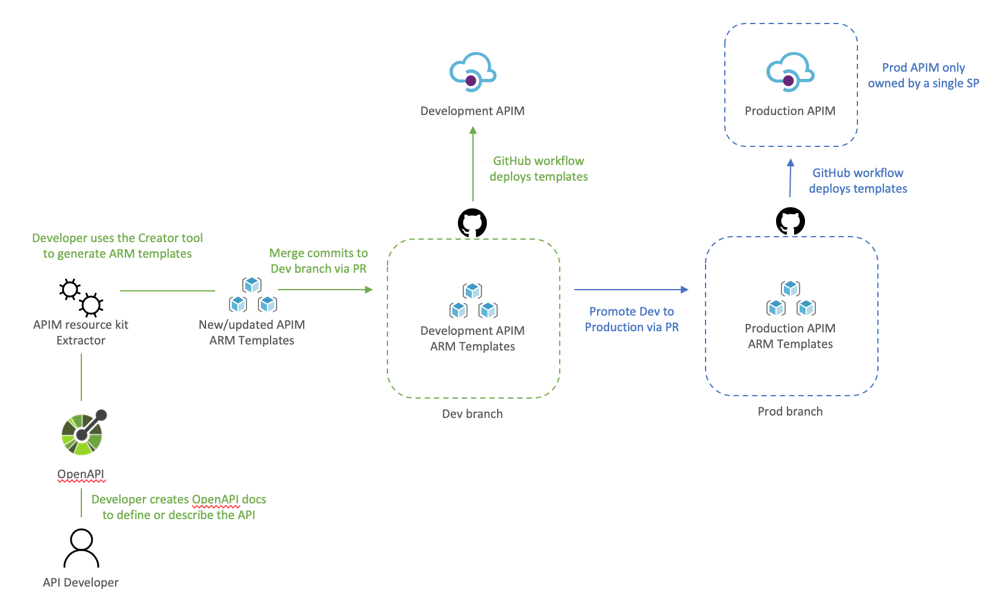
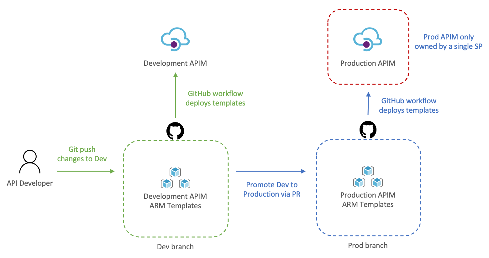

# Adopting a DevOps process in Azure API Management using Azure APIM DevOps Resource Kit

This article was inspired by [Azure/Azure-Api-Management-DevOps-Reource-Kit](https://github.com/Azure/azure-api-management-devops-resource-kit) and targets the HowTo process vs the semantics of the problem and the proposed solution, which are very well defined i the Resource Kit GitHub page.

In this scenario our Azure API Management service (APIM for short) has been deployed and in production for some time already, the API publishers and API developers all use the Azure Portal to operate the service and launch new APIs. Publishers and Developers have agreed that it is time to adopt a DevOps process to streamline the development, management, and environment promotion of their APIs. 

This is a transformation journey, thus it is important to keep in mind that the current Prod APIM will still be Prod. Our journey will:
1. Provision Dev environment
2. Adopting a DevOps process
    - For API publishers
    - For API developers
3. Going live with DevOps


## Provision Dev environment

The Dev environment is created by taking a snapshop of Prod to achieve symmetric between the two environments. During this step the two instances are not synchronized, therefore, you can either abstain from making changes to Prod, or repeat the initial manual deployment of Dev. We will:
- Use the *extractor* tool to capture the current Prod deployment, 
- Check the Prod ARM templates into a new repository, and create a dev branch, 
- Deploy dev branch to our Dev environment 

To help us visualize the process let's take a look at the following diagram:



### Using the *extractor* tool to capture Prod

Because we are in a transformation journey, we want the capture to entirely reflect Prod, thus the config used for the Extractor is set to use the production APIM as the source and the destination, this way the ARM templates generated are always production ready. Remember, we are creating development off production, we will override parameters at deployment time to target the Dev instance.

The config file defines how the Extractor will generate the templates, the following **apimExtract.json** will use the same instance as the source and target, split each API into its own entity, and parametarize most of the assets needed. 

```json
{
    "sourceApimName": "apim-contoso",
    "destinationApimName": "apim-contoso",
    "resourceGroup": "Prod-Serverless-App1",
    "fileFolder": "./contoso",
    "linkedTemplatesBaseUrl": "https://raw.githubusercontent.com/romerve/RvLabs/master/servless-devops/apim/contoso",
    "policyXMLBaseUrl": "https://raw.githubusercontent.com/romerve/RvLabs/master/servless-devops/apim/contoso/policies",
    "splitAPIs": "true",
    "paramServiceUrl": "true",
    "paramNamedValue": "true",
    "paramApiLoggerId": "true",
    "paramLogResourceId": "true"
}
```

Extract the current deployment of your environment:

```bash 
apimtemplate extract --extractorConfig apimExtract.json 
```

The initial extraction saves the ARM templates to **contoso** folder. This folder will only store files that have extracted and that are considered service level. 

Once the *extractor* finishes generating the ARM templates, they need to be added to a repository. This will give us a master branch with production ready templates, which will later be automatically deployed via Pull Request ( PR ). 

### Checking ARM templates into the repository

Head over to *Github* and create a new repository. Prepare your folder hierarchy before adding, committing, and pushing the ARM templates. At the root, we have two folders:
- *contoso*: which is the folder created by the *extractor* tool and contains the templates
- *apis*: this folder is not used now, but will be used later for all API development, and used by API developers

With the initial commit done, we are ready to create a the dev branch:



Checkpoint: by now you should have:
- ARM templates of Prod APIM instance
- A repository with Prod templates checked into master
- A new dev branch

### Deploy dev branch to Dev APIM 

I'll be using *GitHub Actions* to automate deployments to Dev APIM and subsequently to Prod APIM. 

The workflow [**Dev-Apim-Service.yaml**](../.github/workflows/Dev-Apim-Service.yml) has the following responsabilities:
1. Set environmental variables at the job scope so they can be used across the entire worflow. Besides specifiying the dev resources to target, we use a built in variable **GITHUB_REF** to build URLs used for dev deployments. Additionally, because service level changes and APIs can be develop at different rates, we use **On.Push.Paths** to specifcally where service level templates are placed. 
2. Uses the Checkout Action and the Azure Login Action. The Azure Login action makes use of a service principal to login and run commands against your Azure subscription. To create and use a service principal, create a GitHub secret with the output of:
```bash
az ad sp create-for-rbac
    --name "myApp" --role contributor \
    --scopes /subscriptions/{subscription-id}/resourceGroup/{resource-group} \
    --sdk-auth
                            
  # Replace {subscription-id}, {resource-group} with the subscription, resource group details of your APIM environments
```
3. The las two actions: Deploy APIM Service and APIs, and Deploy APIs will use the Azure CLI to deploy the service template, and then each of the extracted APIs. Important to note that here even when we use the parameters file, we still override the service name and URLs so that the proper environment is used. The Deploy APIs step queries APIM using `az rest` to get a list of APIs to iterate over the APIs and deploy them.

At this point you should have a full CI/CD workflow that automatically deploys your Dev branch into your Dev APIM instance.

Before continuing, this would be a good place to validate the Dev instance and ensure all is working as expected. 

## Adopting a DevOps process to manage, operate, and develop APIs in Azure API Management

Once the initial Dev APIM has been created it is important that the two personas: API publishers, and API developers incorporate new steps in their process. Typically, API publishers will use the Azure Portal to make changes, and API developers would be working with OpenAPI, but this could also cause configuration drift, and having the two instances running different APIs. 

Therefore, API publishers and developer need to incorporate the Azure APIM Resouce Kiy in their process workflow. need use the Extractor tool as the last step in their process.

### For API publishers

The following diagram illustrates how an API publisher would work with the Dev APIM. 



API publishers would:
1. Clone the Dev branch to their local environment
2. Make the desired changes to Dev APIM using the Azure Portal
3. Capture the newly applied changes by running *extrator* tool (`apimtemplate extract --extractorConfig apimExtract.json `) against the Dev APIM
4. Add, and commit the new or updated templates into the locally cloned repo (`git commit -a`)
5. Push the updated templates to automatically re-deploy the changes to Dev APIM (`git push`)

The reason the changes done via the portal are then re-applied to Dev APIM via *Github Actions* it's validate that templated can be successfully deployed via code, and it allows for dev branch to be merged into master via PR.

Dev branch deployments is triggered by [**Dev-Apim-Service.yaml**](../.github/workflows/Dev-Apim-Service.yml), which filters branch level events to only include changes done to **contoso** and overrides parameters to target Dev APIM.

### For API developers

The diagram would show what a developer process would look like.



API developers would:
1. Clone dev branch to their local environment
2. Define or update API docs
3. Use the *creator* tool to generate ARM templates (`apimtemplate create --configFile ./apis/<API-FOLDER>/<API>.yml`)
4. Add, and commit new or updated templates into the locally cloned repo (`git commit -a `)
5. Push the changes to trigger the Dev deployment (`git push`)

The reason the APIs are saved to **apis** instead of somewhere inside **contoso** folder it's so that developing APIs does not trigger an APIM service deployment. And using a separate workflow [**Dev-Apim-Apis.yaml**](../.github/workflows/Dev-Apim-Apis.yml) we can better control how the two are triggered and deployed.


## Going prod with DevOps

Once Dev APIM is validated and publishers and developers have incorporated the changes in their process, it is time to promote Dev to Prod. The promotion it's done by creating a pull request from dev to master as illustrated below.



Let's review how this works:
1. API developer push changes to repo's dev branch
2. The push triggers the workflow to automatically deploy Dev APIM
3. API developer creates a pull request
4. The team reviews the PR and approves the PR to merge dev changes into master
5. Merging into master triggers *Github Actions* to deploy to prod

Because the templates' parameters files already target prod there is no need to override anything, therefore, the CD workflow simply deploys any templates it finds in *contoso* and *apis*.
